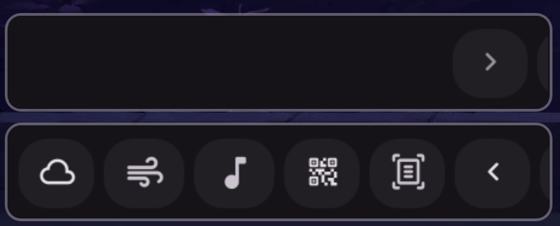

# Hidden Bar

Hide unused bar widgets and expand them on demand.



## Install

[**Install Now**](dms://plugin/install/hidden-bar)

Or manually:
```bash
git clone https://github.com/hthienloc/dms-hidden-bar ~/.config/DankMaterialShell/plugins/hidden-bar
```

## Features

- **Smart hide** - Collapse widgets to save bar space
- **Hover to expand** - Reveal hidden widgets by hovering over the trigger area
- **Auto-collapse** - Hide again after inactivity
- **Exclude items** - Keep system tray or clock always visible

## Usage

| Action | Result |
|--------|--------|
| Left click | Toggle expand |
| Right click | Pin/unpin expanded state |

## License

GPL-3.0